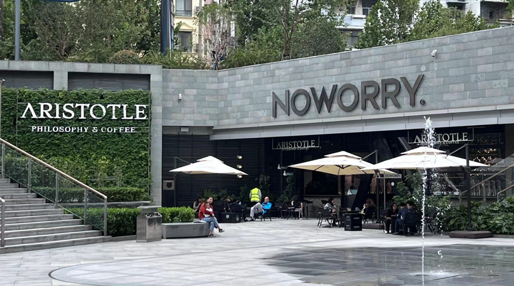
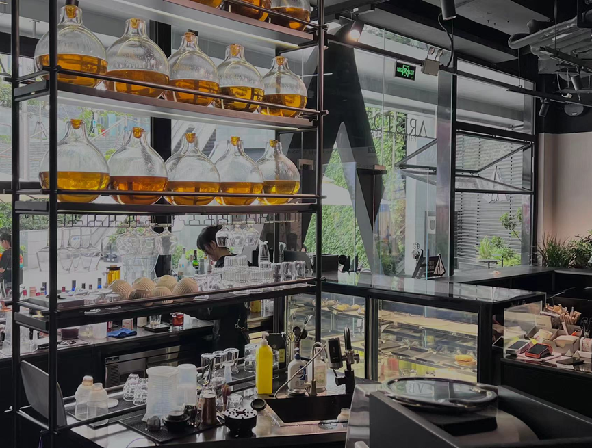
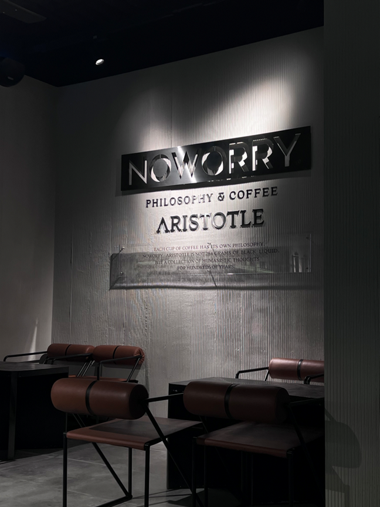
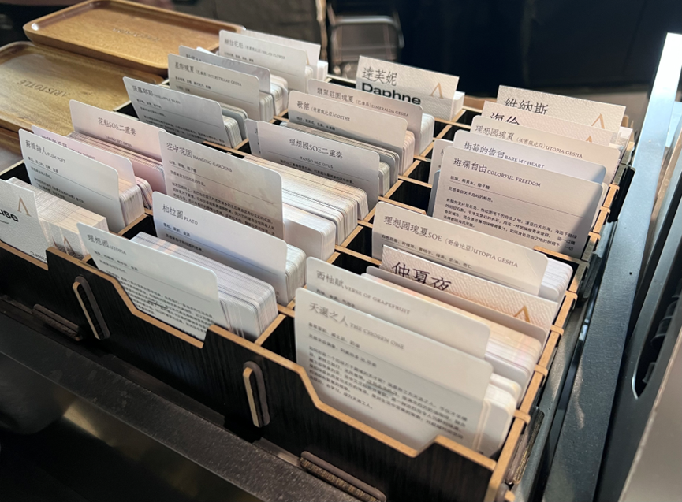

# ARISTOTLE亚里士多德·哲学咖啡

探店人：冰

湖北武汉

地址：湖北省武汉市硚口区京汉大道688号恒隆广场B121

营业时间：9:00-21:30

> Slogan: 幸福是把灵魂安放在最适当的位置

国庆假期和朋友决定在行程紧凑的旅途中抽出一天时间在此小憩，品尝咖啡，品味哲学。咖啡厅坐落于商场下沉广场的立体绿植墙旁。整个咖啡厅的装修风格现代简约，进入咖啡馆内部，棱角分明的钢筋骨架和现代简约高级的大理石地板为整个咖啡厅铺垫了底色，恰到好处的灯光在昏沉的空间中划分出一块块明亮而温暖的空间。这是一家集咖啡师技艺与哲学家气质于一身的咖啡厅，绵绵阴雨的日子，坐在其间，点一杯咖啡，品读一本哲学巨著，好似在小屋火炉旁沉思的笛卡尔。

我和朋友一共点了四杯咖啡，分别是：

柏拉图、理想国、达芙妮、？

 

每杯咖啡都附上了关于其创作灵感的小纸条。

### 理想国UTOPIA

<u>瑰夏、柠檬草、佛手柑、金酒</u>

> 灵感来自哲学巨作。
>
> 《理想国》是整个西方世界的哲学经典，也是我们一直追求的生活态度。
>
> 柏拉因的精神世界纯粹至极，他描绘的理想世界充满理性、正义和善良。
>
> 我们用的瑰夏是目前最好的品种之一，用它来代表这种精神世界的极致追求，在瑰夏的柑橋酸质的基调下，将柠檬与卡比奥柠檬佛手柑金酒融合，收获到柔和且饱满的果汁感。加以柠檬草的点缀，犹如站在智慧之树下，嗅觉和味觉的双重登加体验。
>
> 你越是多思考一点，那个理想国的世界就越是色彩斑斓。一如瑰夏，你越是细品，越能有更丰富的味觉发现。
>
> 去看这本书吧。

 

### 达芙妮Daphne

<u>桂花香、荔枝果味、气泡美式（花果）</u>

> “美好如月光的女神，桂冠之下，确实难以言表的爱意，一个只能留给自己的秘密。”

作为一个早咖晚酒的Café bar，除了咖啡因饮品，还有酒精饮品

### 柏拉图PLATO

<u>雪松，茉莉，金酒</u>

> 灵感来自于柏拉图的思考。
>
> 很累的时候想喝一点酒，会想起生活中做过的选择，柏拉图曾说：
>
> “人生最遗憾的，莫过于轻易地放弃了不该放弃的，固执地坚持了不该坚持的。"诸多的烦恼往往都因为选择而生。所以也许需要一点自省，一点返璞归真，一如这杯液体的无色透明与微微的苦感，但又像清晨打开森林木屋的房门，清澈的空气里，有花，有草，有树。
>
> 愿你放下固执，不留遗憾。

## 总结

不过，作为一个对于咖啡本身并没有很多了解的人，这家店更吸引人的是它的概念设计。此店以“哲学咖啡”为理念，从西方神话、哲学巨著和景色中找创作灵感，并将艺术形式融入咖啡外观设计之中呈现出来。个人感觉有点过于侧重于艺术形式的呈现，反而忽略了咖啡本身作为饮品的口味功能。整体上来说，四杯咖啡下肚，咖啡本身的口味并没有那么好（也可能是是我本人的问题），相比之下其设计理念和咖啡厅整体的环境带给我的愉悦感会更高一些。总而言之，本咖啡馆更适合工作学习、朋友小聚和拍照打卡，但对于以咖啡本身要求比较高的朋友们来说，这家咖啡厅并不是最佳选择。

> 本店为武汉本土咖啡品牌NO WORRY的高端主题店，在武汉还有另外一家复古装修风格的分店。
>
> 分店地址：湖北省武汉市江岸区台北二路43号万象城漫岗街区p110