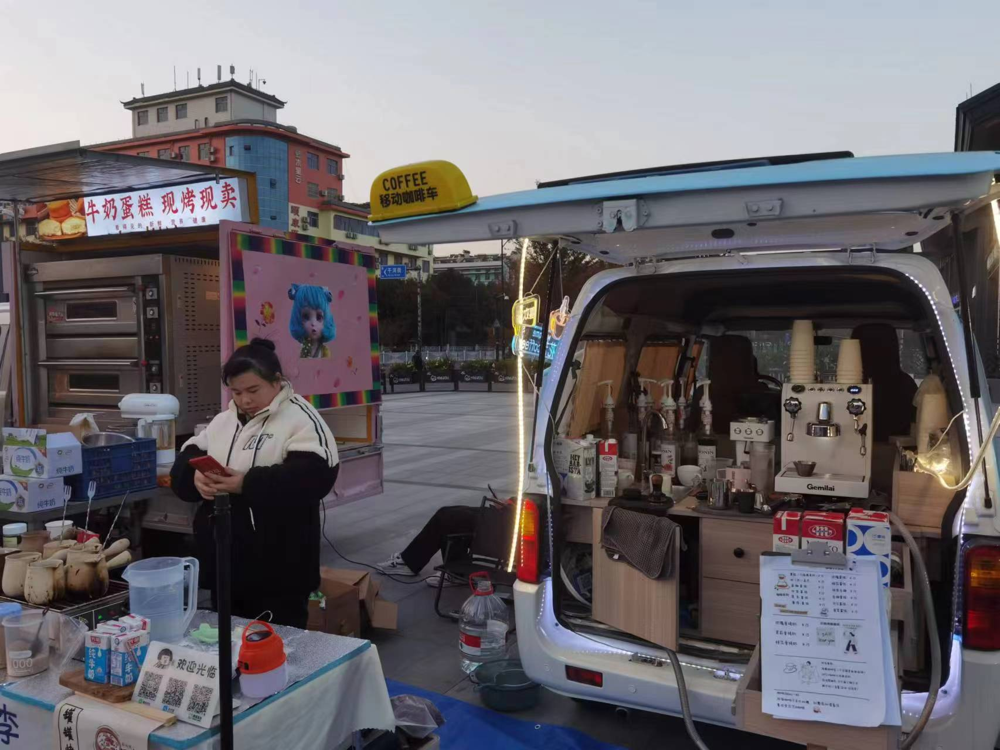
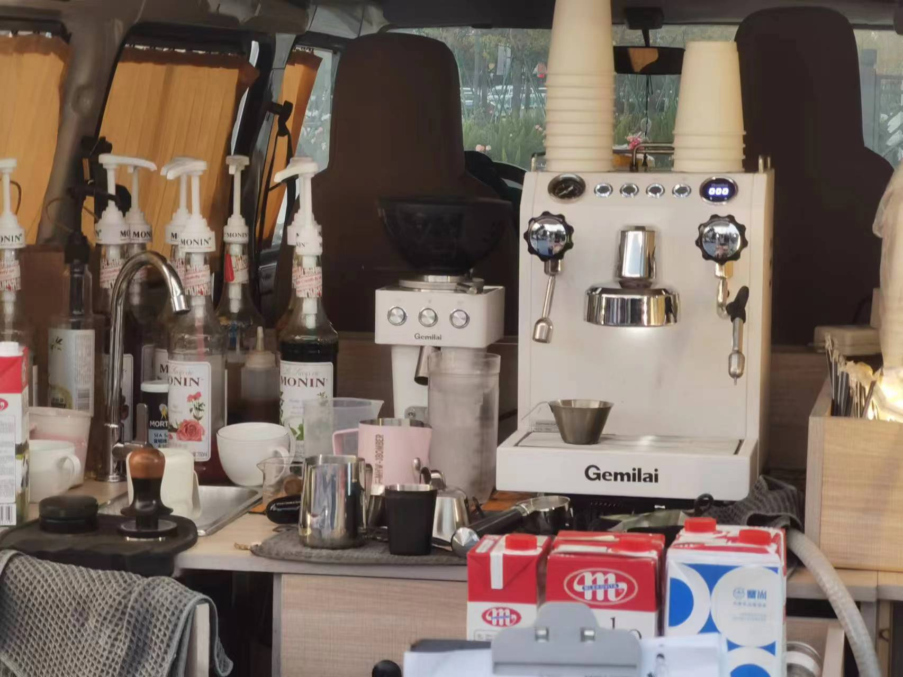
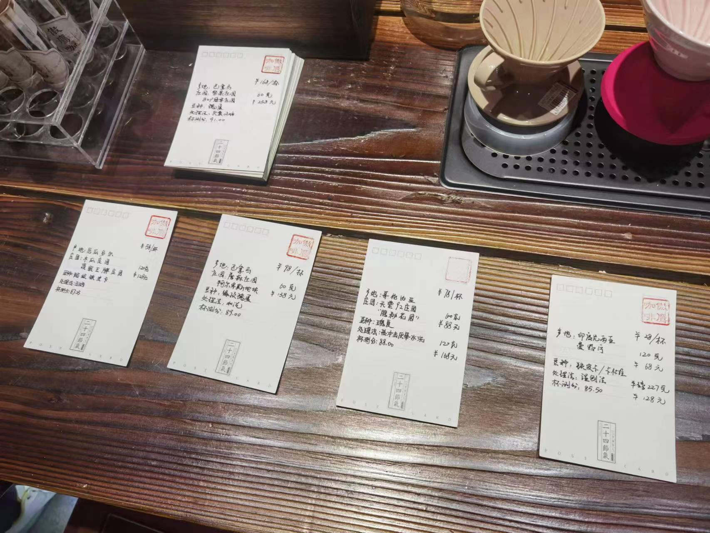
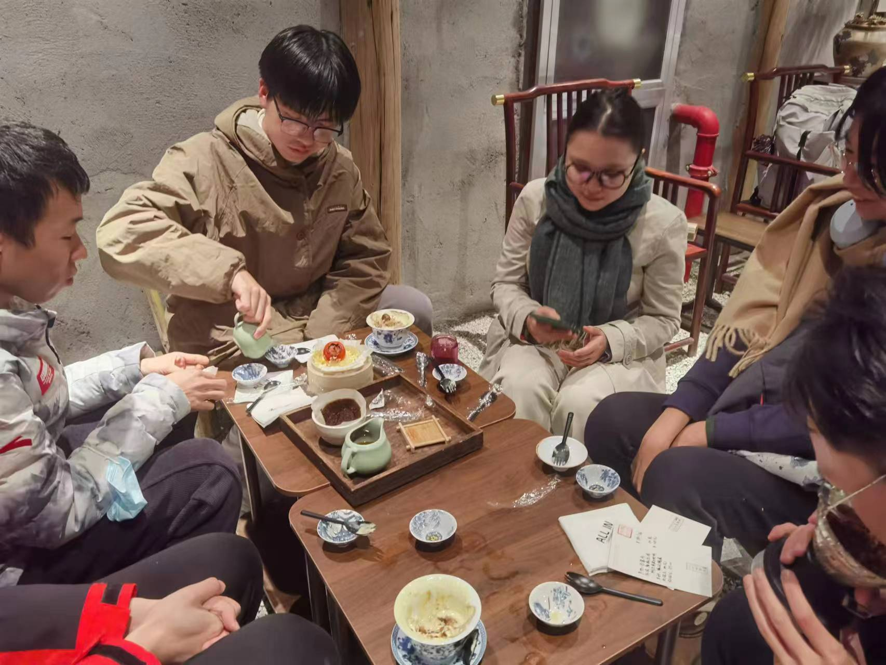
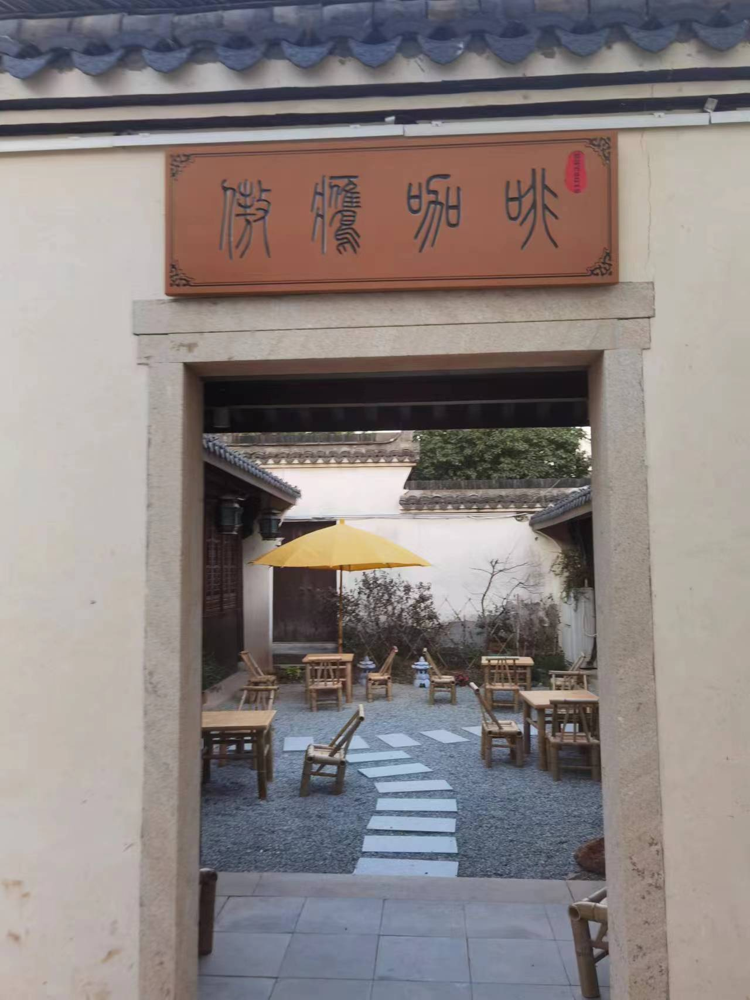

# 海宁 ALL-IN CAFE 横头街店
2023.11.17 活动记录

探店人：滋滋
> 浙江海宁
>
> 地址：浙江省海宁市横头街区14幢 （在非常非常里面的地方，一直沿着河往里走）
>
> 营业时间：11：00-21：00

恰逢一周的课业和考试结束，周五的傍晚，我们来到ALL IN CAFÉ。这是一个僻静的地方，依傍着无名之河，找到这里就花了一点功夫。木墙黑瓦，木桌竹椅，石板和碎石相间的地面，装修颇有江南园林的意蕴，意外的是还有一个中庭，就连latte的杯子都是青瓷茶碗，盛Basque的都是竹制蒸笼。咖啡文化和中国古典文化的碰撞给了我小小的惊喜。这是一家小有名气的咖啡店，海宁首届咖啡节中就参展过，在吧台与咖啡师的聊天之中了解到，主理人过几天还得外出打比赛。但是不管怎么样，品鉴咖啡还是我们今天的主要任务。

> 寻找店铺时，路边看到的 真-现磨咖啡，反映当今咖啡市场多么下沉

<!-- 恰逢一周的学业和考试告一段落，周五的黄昏，我们踏入了ALL IN CAFÉ。这里位于幽静的角落，依偎着流淌不尽的无名河流，寻找这个地方花费了一些心思。木墙黑瓦，木桌竹椅，地面由石板和碎石交错铺设，这里还带有一个中庭，仿佛具有江南园林的意蕴。令人意外的是，拿铁置于瓷质茶碗，Basque盛放在竹制蒸笼之中。咖啡文化与中国古典文化在此相互融合，给了我一份小小的惊喜。这是一家小有名气的咖啡店，海宁首届咖啡节中就参展过，在吧台与咖啡师的聊天之中了解到，主理人过几天还得外出打比赛。但是不管怎么样，品鉴咖啡还是我们今天的主要任务。!--> 

## 咖啡

我们一共点了四杯手冲咖啡，
每一款咖啡的简介都写在明信片上，

## 厄瓜多尔-木瓜庄园

¥58 

> 顶级王牌庄园

- 豆种：超级铁皮卡

- 处理法：日晒

- 杯测分：87.5

### 评价：

## 巴拿马：詹森庄园埃豆种，

¥98

> 阿尔卑斯地块

- 豆种：顶级瑰夏

- 处理法：水洗法

- 杯测分：89.00

### 评价：

## 哥伦比亚：天堂92庄国

¥78

> “隐秘花园”

- 豆种：瑰夏
- 处理法： 冲击厌氧水洗
- 杯测分：88.00

### 评价：

## 印度尼西亚：曼特宁

¥28

- 豆种: 铁皮卡

- 处理法：湿刨法

- 杯测分：85.50 

### 评价：

## 第三次咖啡浪潮

来ALL-IN Cafe不仅仅是品尝；这是一个轻松的COFFEE101。在这里，我们讨论为什么精品咖啡有更高的价格，这是由它无与伦比的质量和对其生产过程的精心关注所赋予的合理性。从种子到杯中，每一粒豆子的旅程都是对致力于为我们带来这些特殊酿造的独特风味。

在ALL-IN，您可以品尝许多不同的豆子，每一种都有其独特的风味。您将体验到第三波咖啡浪潮对直接贸易和手工方法的拥抱是如何丰富我们的咖啡体验的。这可以反映在手冲、冰滴以及许多其他关于冲泡的新技术和新想法上。

## 总结：

> 第一次参加哲咖社的活动，这次我们来到了位于横头街的ALL IN CAFE。不同于传统咖啡店，ALL IN CAFE 大胆地尝试将中式风格与咖啡文化相点缀，以庭院，流水，假山石等造景给人你以耳目一新的体验。店中的氛围甚佳，我们品尝了四种不同风味的咖啡豆，各中差异给我这个咖啡小白以全新的体验（品鉴力有待提升）。值得一提的是本次印尼的同学还向我们分享了家乡的咖啡文化，由此也可一瞥地域气候等对咖啡生产与品鉴习惯的影响。探店之旅末，店长和学长还向我们介绍浩浩汤汤的咖啡革新浪潮，以此为基点，也许我也将成为见证与亲历者。 --- 万煜翔
>
> This is my first Coffee shop tour at PhiloCoffee Club and it’s amazing. I’m stunned by the club members’ passion for coffee, as well as their wisdom. --- 徐纬立
>
> This is my second time joining PhiloCoffee’s Coffee tour and I enjoyed the ambiance of All in Cafe. The coffee shop’s unique interior and diverse blends were memorable, and I was impressed by how knowledgeable my fellow club members were on coffee-making and its culture. --- Theresa 魯世真

室内装修充满了创新和独特性，虽然个人觉得这种大胆的尝试在某些细节上可能稍微有点过于前卫。特别是在用传统的茶碗品尝拿铁时，我感到了一种微妙的风格上的不搭调，这种感觉在尽情欣赏那凤凰形状的拉花时尤为突出。然而，这样的设计确实给品鉴带来了一种新的体验。

品尝一杯好咖啡就像咬下一块多汁的水果。第一口是新鲜而活泼的，就像喝一杯橙汁。然后，当你继续喝时，你可能会注意到它又甜又浓郁，有点像嚼着一个饱满的葡萄。有时，甚至会有一点巧克力或坚果的味道悄悄出现，使人感到温馨和舒适。整个过程在你的口中留下一种愉快、顺滑的感觉。

这家店提供了各式各样的豆子，每种咖啡都有其独到的风味，确实令人赞赏。今天我们尝试了几款风味迥异的豆子，因为有一位来自印尼的朋友，我们点了杯曼特宁。在探讨第三次咖啡浪潮后，她也向我们细致地介绍了印尼的饮咖文化。这样的体验让我对咖啡的味道有了更深的敏感度和理解。

总体来说，这家店是探索不同咖啡豆之美、享受朋友间交流，以及捕捉美好瞬间的理想场所。
