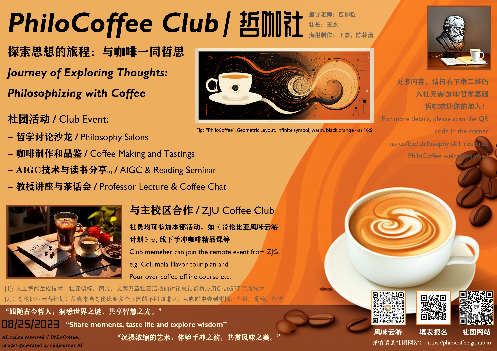

# PhiloCoffee / 哲咖 

Welcome to PhiloCoffee, where we explore the intersection of coffee and philosophy!

欢迎来到PhiloCoffee（哲咖），在这里，我们探索咖啡与哲学的交汇点！

## About Us / 关于我们

PhiloCoffee is based in Zhejiang University's Haining International Campus. We focus on exploring the crossroads of coffee and philosophy, finding insights through the shared experience of a delicious cup of coffee.

哲咖是一家坐落于浙江大学海宁国际校区的学生社团，我们专注于探索咖啡与哲学的交叉点。我们相信，在一杯美味的咖啡中，我们能够找到哲学的启示，并通过这种共享的体验，加深我们对生活和现实的理解。

### Our Mission / 我们的愿景

- Explore the connection between coffee and philosophy / 探索咖啡与哲学之间的联系
- Foster international exchange and academic discussions / 促进国际交流和学术讨论
- Encourage hands-on experiences with coffee brewing and philosophical debates / 鼓励咖啡冲泡和哲学辩论的实践体验

PhiloCoffee will provide an open, inclusive, and interactive platform to promote cultural exchange and academic discussions both within and outside the international campus. Our mission is to advocate the concept that 'philosophy should be part of daily life.' Through the everyday element of coffee, we lead club members to deeply understand and practice philosophy, applying its essence to daily life.

PhiloCoffee将提供一个开放、包容且互动的平台，促进国际校区内外的文化交流和学术探讨。我们的宗旨是倡导'生活中应有哲学'的观念，通过咖啡这一日常生活元素，带领社团成员深入理解并实践哲学，将其真谛应用到日常生活中。

We believe that from the beverage choices of philosophical masters like Kant, Voltaire, and Marx, we can gain insights into their pursuit of knowledge. For international friends on campus, coffee is not only a daily habit they grew up with but also a link to their culture. We encourage club members to participate in various activities such as philosophical salons, coffee tasting, and brewing, to enhance their practical skills while experiencing the collision and fusion of Eastern and Western philosophies through thinking and interaction.

我们相信，从康德，伏尔泰和马克思等哲学大师的饮品选择中，我们可以洞察其对知识的追求；而对于校园里的国际友人，咖啡则是他们从小长大的日常习惯，更是一种文化的链接。我们鼓励社团成员参与到各种活动中，如哲学沙龙、咖啡品鉴与制作等，通过这些活动提高他们的实践技能，同时让他们在思考和交流中感受到中西哲学的碰撞与融合。

## Recent Activities / 近期活动
1. “你读了哪些有关咖啡和哲学的书？" ---在线文笔记录分享
社团可以定期写书摘推荐的活动彼此之间分享有趣的老书或新书，如果愿意以后可以彼此借书，写写画画，这样回到手中的书就承载着别人的思考，也是一种很好的社交

咖啡方向的技术书刊也鼓励分享，比方《咖啡年刊2022》，《世界咖啡地图》

> 关于哲学和咖啡的入门可以参考：《咖啡与哲学——对话体哲学导论》
这里是我写的简单书评，别的同学有兴趣也可以在issue里更新自己读的数目
https://github.com/PhiloCoffee/Philo_Chat/issues/5

投稿要求请见readme.md：

https://github.com/PhiloCoffee/Philo_Chat

## Our Articles / 我们的文章
- [爱咖啡的哲学家](philosophy/0807_爱咖啡的哲学家.md)：

### phiosophy / 哲学部
- [爱咖啡的哲学家](philosophy/0807_爱咖啡的哲学家.md)：探索哲学家对咖啡的热爱以及其背后的深刻哲学涵义。
  
- [CoffeeShop Tour](philosophy/1005_CoffeeShopTour.md):A Day of Insightful Chat and Delightful Brews!

### coffee /咖啡部
- [咖啡的历史起源](coffee/0807_咖啡的历史起源.md)：一篇深入探讨咖啡起源和演变历程的文章，完美融合了历史和文化分析。

### tech / 技术部
- [如何使用GitHub搭建并托管社团网站](tech/0807_如何搭建自己的社团网站.md)：一篇详细指导，让你了解如何使用GitHub Pages轻松搭建自己的社团网站。

## Our Activities / 我们的活动

**关键字：咖啡，哲学，社团，中西融合，国际交流，学术入门，文化沙龙**

- **Philosophy Salons**: Engage in deep discussions on various philosophical topics.
- **Coffee Making and Tastings**: Learn about different coffee varieties and brewing techniques.
- **Reading & Movie Seminar**: Through the lens of cultural philosophy, appreciate contemporary art and popular movies together, seeking deeper understandings and connections.
- **Collaborations**: Partner with other coffee shops and clubs to foster cultural exchange and shared learning.

活动形式包括但不限于：
- 哲学咖啡沙龙：这是我们的主打活动，我们会在此探讨各种哲学问题，并品尝与讨论主题相关的咖啡。例如，我们可能会探讨萨特的存在主义，同时品尝浓郁、苦涩的意式咖啡。
- 咖啡制作和品鉴：我们会邀请咖啡师来教大家如何制作各种咖啡，并进行咖啡品鉴。
- 社团读书会与观影会： 从文化哲学的角度，一同赏析当代艺术与流行电影。
- 与校园内的多家咖啡厅合作：我们希望与校内的咖啡厅合作，一起开展各种活动，推广咖啡文化。

## Our Mentor / 我们的导师
We are honored to announce that Professor SHAO KAI TSENG, a scholar with profound expertise in the field of philosophy, has agreed to become the mentor of our club.

我们很荣幸的宣布，曾绍恺教授, 一位在哲学领域有深厚造诣的学者，已经答应成为我们社团的指导老师。

## Join Us / 加入我们

Interested in coffee, philosophy, or both? Join us and contribute to an energetic and inclusive community!

我们欢迎所有对咖啡和哲学感兴趣的学生加入我们的社团，无论你的专业是什么，无论你对咖啡和哲学的了解有多少，只要你对学习和分享感兴趣，你就是我们要找的人！

### 填写问卷即可加入：
https://www.wjx.top/vm/mjNY6AP.aspx

### 加入我们，你将能:
1. 亲自尝试半自动意式咖啡机， 从浓缩到拉花，制作专属于你的一杯拿铁。
2. Through the lens of cultural philosophy, appreciate art and movies together
3. 一同探店精品咖啡，参加杯测会，与专业咖啡师交流技术
4. Extend vision from Phil101 & Phil206, touring with Prof. Tseng again

The brewing process of hand-poured coffee has many similarities with tea preparation, offering us a unique perspective to integrate Chinese tea culture with Western coffee culture, showcasing the blend of Eastern and Western philosophies.

手冲咖啡的冲泡过程与茶的泡制有许多相似之处，这为我们提供了一个独特的视角，将中国的茶文化和西方的咖啡文化融合，通过这种融合展现中西哲学的交融。

We maintain close collaboration with the Zhejiang University Student Coffee Club (ZJU Coffee Club) at the Zijingang Campus and the Philosophy Club at UIUC University, exploring the transmission of coffee culture, learning from each other, and making collective progress. We look forward to every member who joins PhiloCoffee, working together to create a vibrant, inclusive, and intellectually stimulating club.

我们与浙大紫金港校区的浙江大学学生咖啡社（ZJU Coffee Club）和UIUC大学的Philosophy Club（哲学社）保持紧密合作，一起探讨咖啡文化的传递，互相学习，共同进步。我们期待每一个加入PhiloCoffee的成员，能共同创造一个充满活力，包容并充满智慧的社团。

如果你想加入我们，或者有任何问题，欢迎通过电子邮件：[philocoffeeclub@gmail.com](philocoffeeclub@gmail.com)或通过[GitHub issue](https://github.com/PhiloCoffee/PhiloCoffee.github.io/issues)联系我们。

[Contact Us: philocoffeeclub@gmail.com](philocoffee@gmail.com) 

---
“跟随古今哲人，洞悉世界之谜，共享智慧之光。”

"Share moments, taste life and explore wisdom”

“沉浸于咖啡的艺术，体验手冲之韵，共赏风味之美。”

**© 2023 PhiloCoffee Club / 哲咖**
