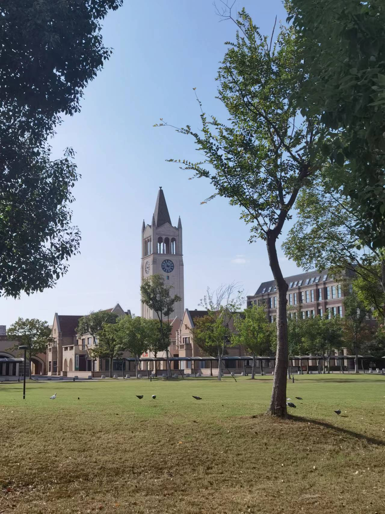
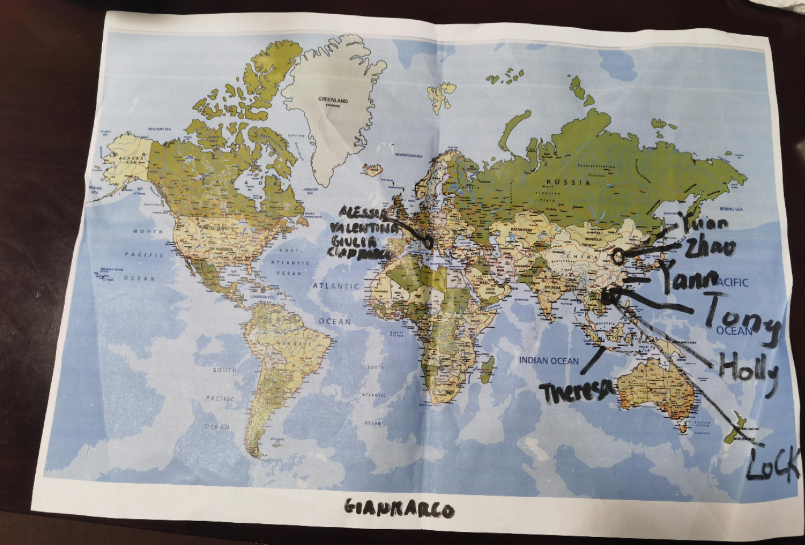
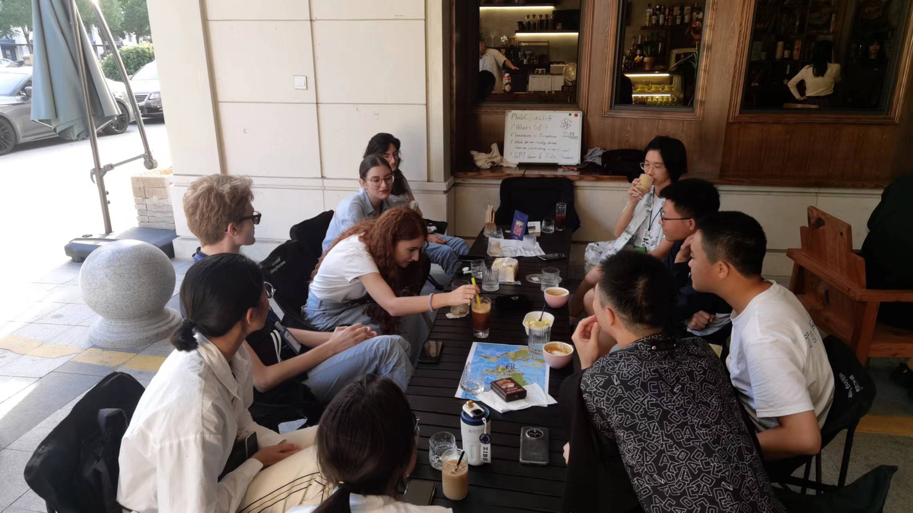
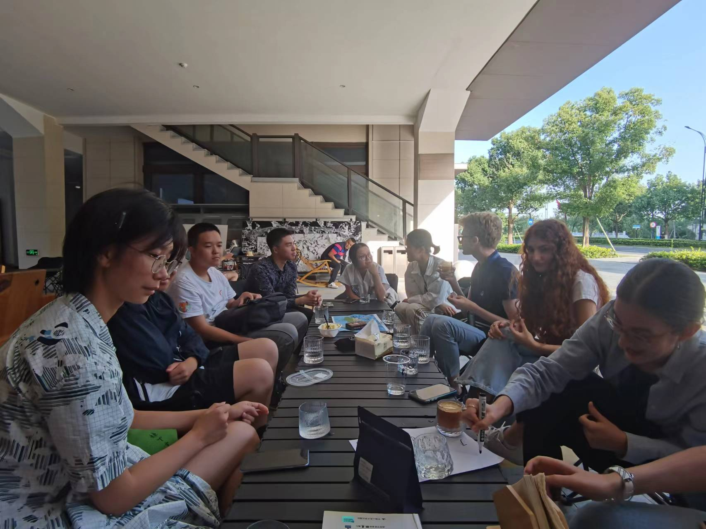
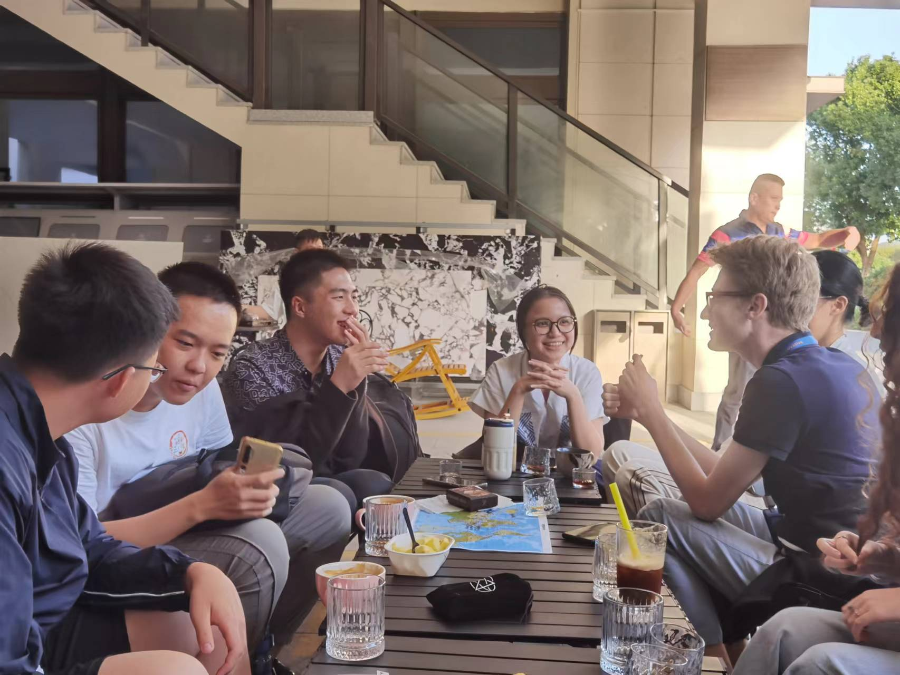
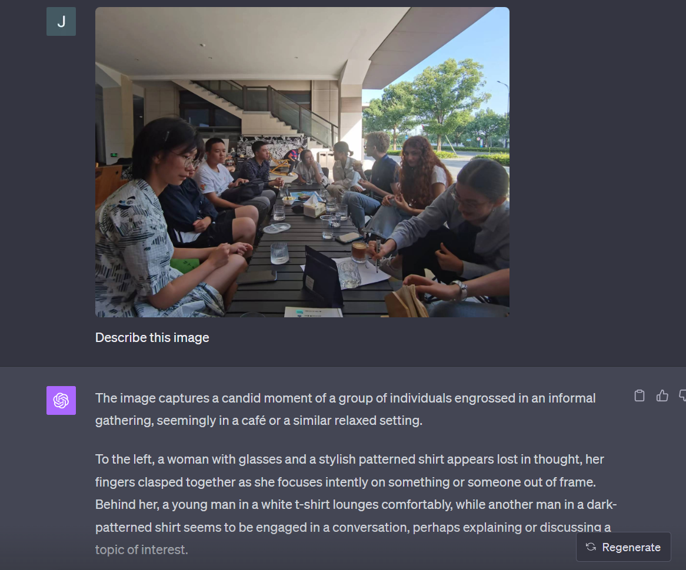

# Coffee Shop Tour: A Day of Insightful Chat and Delightful Brews!

> Tony, Yann & ChatGPT
>
> Oct 05 2023

[toc]

The PhiloCoffee had an engaging and enlightening event that spanned from cultural exchange to deep philosophical discussions. Surrounded by the aroma of fresh coffee, we delved deep into philosophical discussions, cultural exchanges, and even touched upon the realms of artificial intelligence. 

### Perfect Afternoon for walking toward the coffeeshop

## Cultural Exchange on World Map

Members initiated the event by marking their mother countries on a world map. This facilitated an intimate introduction to one another, with individuals sharing unique cultural features and traditions from their respective homelands.

## What's a cup of coffee?

A deep dive into the world of coffee was led by our Italian member, Giulia. Members got a taste of the Italian coffee culture, learning about traditional habits and preferences. This was not just an auditory experience; members got to order and savor their own coffees during the discussion.

### Dirty

### 冰镇黄杏椰椰 Chilled yellow apricot coconut coffee

### **Perception vs. Sensation**

While sipping on our lattes, Tony pondered over a fascinating question: What do we really taste when we drink a cup of latte? Is it the raw sensory input of the coffee's flavor, or is it our mind's interpretation of that flavor? We delved deep into the philosophy of sensation and perception, with Gianmarco offering some riveting insights from Berkeley: **"To be is to perceive or to be perceived."** As we sipped our brews and exchanged thoughts, the lines between raw taste and our perception of it started to blur.

### **Utilize LLMs to enhance discussion**
The discussion soon shifted to the intriguing world of AI, particularly ChatGPT. We explored the nuances between ChatGPT 3.5 and its Plus version and even ventured into prompt engineering's intricacies. Our collective musings led us to wonder about AI's potential future impacts, especially on the job landscape.

### **Movie Night Selection: Philosophical Delights on Screen**
When we come back home, we brainstormed a perfect film for club's upcoming movie night. After much deliberation, the consensus was to dive into Christopher Nolan's "***Tenet***" - a choice influenced by the movie's gripping narrative and thought-provoking philosophical undertones. We're all eagerly waiting for this communal cinematic experience!

---

Overall, the day was a beautiful blend of robust discussions, cultural revelations, and of course, excellent coffee. Can't wait for our next activity!

> Special Thanks to Yunhan Zhong for helping design today activity~

